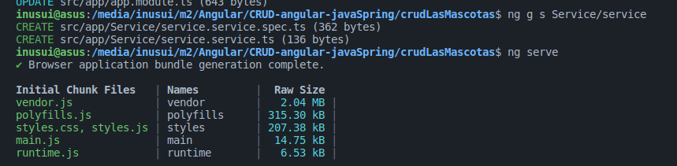

# Componentes

### Forma manual

Angular Generame un modulo, se puede usar para hacer Routing.&#x20;

```
ng g m appRouter --flat
```

### Forma Automatica

Se crean con&#x20;

.png>)

y el servicio



### Crear Componente sin Test and Css

Para crear el componente sin CSS se agrega la bandera.

```
 --inline-style
```

Para crear el componente sin teste se agrega la bandera.

```
 --skip-tests
```


en `ap.components.ts` se debe agregar&#x20;

`<router-outlet></router-outlet>`

que despues no ve las otras paginas al usar router:Router


