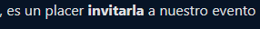

# i18nSelect

```
        {{ keyDelObjetoSeleccionada | i18nSelect : Objeto }}
```

Trata de un objeto, al cual se envia la key del objeto, la cual va a retornar su valor.

```
 invitacionObj = {
    'F':'invitarla',
    'M':'invitarlo'
  }
```


```
        {{ 'F' | i18nSelect : invitacionObj}}
```

Output

<figure><figcaption><p>invitarla es el value del objeto</p></figcaption></figure>

